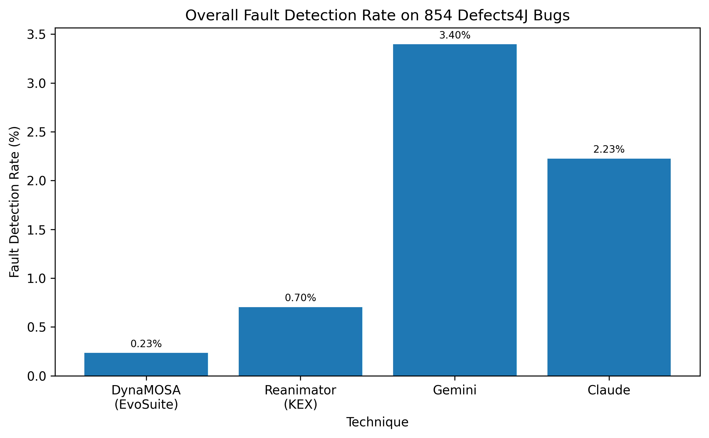
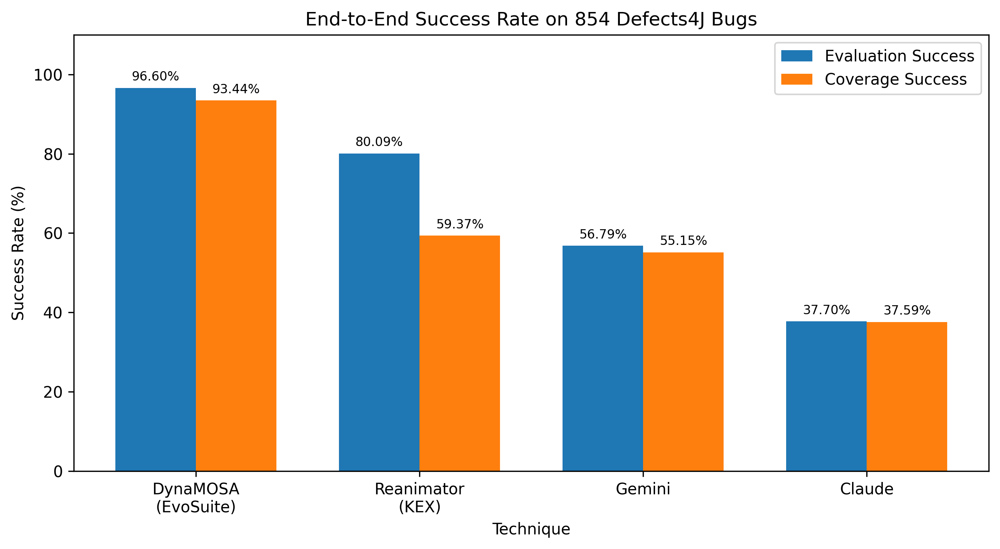
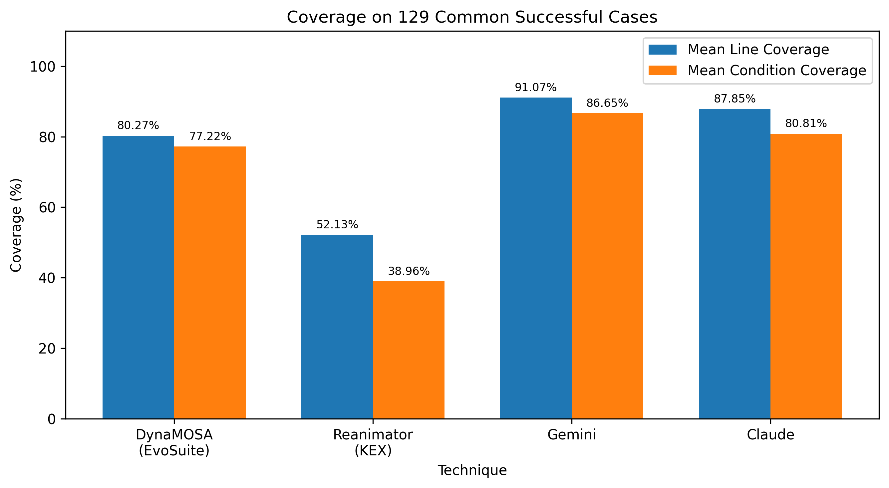
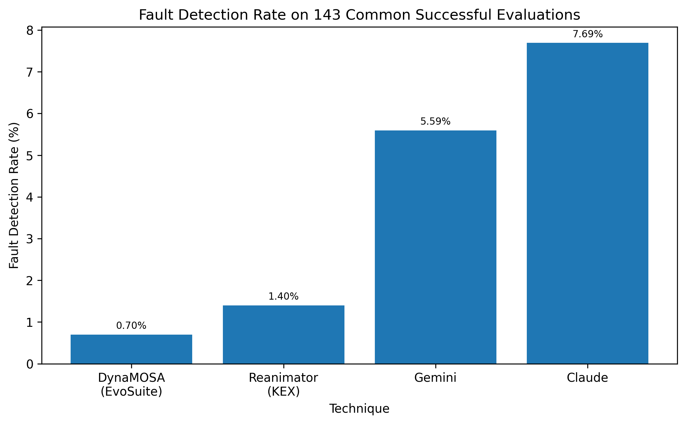

# Project – AI-Assisted Testing vs. Automatic Test Case Generation Algorithms: A Benchmark and Test Coverage Evaluation

**รายวิชา:** CP353201 Software Quality Assurance (ภาคเรียนที่ 1 ปีการศึกษา 2569)
**อาจารย์ประจำวิชา:** ผศ.ดร.ชิตสุธา สุ่มเล็ก | **หลักสูตร:** วิทยาการคอมพิวเตอร์ วิทยาลัยการคอมพิวเตอร์ มหาวิทยาลัยขอนแก่น
**หัวข้อโครงการ:** การประเมินประสิทธิภาพเชิงเปรียบเทียบระหว่างขั้นตอนวิธีสร้างกรณีทดสอบอัตโนมัติ (DynaMOSA & Reanimator) และเครื่องมือ Generative AI (Gemini & Claude) บนชุดข้อมูลมาตรฐาน Defects4J

> **สถานะโครงการ:** การทดลองเสร็จสมบูรณ์ — รันครบทั้ง **854 bugs × 4 เทคนิค** (master results 3,416 แถว) และมีรายงานฉบับสมบูรณ์อยู่ใน repository ([`AI-Assisted Testing vs. Automatic Test Case Generation Algorithms A Benchmark and Test Coverage Evaluation.pdf`](./AI-Assisted%20Testing%20vs.%20Automatic%20Test%20Case%20Generation%20Algorithms%20A%20Benchmark%20and%20Test%20Coverage%20Evaluation.pdf))

---

## 📌 สารบัญ

1. สมาชิกและบทบาท
2. ขอบเขตการทดลองและการวัดผล
3. Configuration ของการทดลอง
4. กฎเหล็กสำหรับชุดทดสอบ
5. โครงสร้าง Repository
6. ขั้นตอนการรันเพื่อทำซ้ำผลลัพธ์
7. ตารางสรุปผลการเปรียบเทียบประสิทธิภาพ
8. ข้อจำกัดและข้อควรระวังในการตีความ
9. เอกสารอื่นใน repository
10. กำหนดการนำส่งงาน

---

## 👥 รายชื่อสมาชิกและบทบาทหน้าที่ (Team Roles & Responsibilities)

โครงการมีสมาชิก **3 คน** (ปรับหน้าที่หลังจากนายจิรภัทร สีสารออกจากกลุ่ม)
**นักศึกษาทั้งหมดอยู่ SEC 02**
| ลำดับ | รหัสนักศึกษา | ชื่อ - สกุล | บทบาทในโครงการ | หน้าที่หลัก & สิ่งที่ต้องส่งมอบ (Deliverables) |
|---|---|---|---|---|
| 1 | 673380415-5 | นายพัชรพล กองแก้ว | **Member 1: Reanimator/Kex Lead & Infrastructure / Data / Repository Manager** | • รับผิดชอบ **Reanimator ผ่าน Kex** (KEX 0.0.11, mode `concolic`)<br>• จัดเตรียมและดูแล **Defects4J**, การสกัด Metadata, Target Classes และ Frozen Target Dataset<br>• ดูแล **Docker Environment / Workspace** และ **GitHub Repository**<br>• พัฒนา/ดูแล **Universal Runner (`run_benchmark.py`)**, evaluation / coverage / aggregation pipeline และระบบ Resume<br>• **Output:** `Reanimator-Kex/`, `dataset/`, `docker/`, `scripts/`, `evaluation/` |
| 2 | 673380430-9 | นายอนันต์เอกก์ ใหญ่พงศกร | **Member 2: DynaMOSA / Search-Based Testing Lead** | • รับผิดชอบ **DynaMOSA ผ่าน EvoSuite**<br>• ตั้งค่าและรัน EvoSuite/DynaMOSA กับ Target Modified Classes ตาม benchmark protocol<br>• ตรวจสอบ generated JUnit tests และผล Line/Condition Coverage, Fault Detection และ Generation Time<br>• **Output:** `DynaMOSA-EvoSuite/` และผลการทดลองที่เกี่ยวข้อง |
| 3 | 673380425-2 | นายวงศธร ธน.ยอด | **Member 3: AI Prompt Engineer (Gemini & Claude)** | • ออกแบบและดูแล Prompt Template สำหรับ **Gemini และ Claude** ภายใต้ข้อมูลและข้อจำกัดเดียวกัน<br>• สร้าง JUnit 4 tests สำหรับ Target Modified Classes ผ่าน KKU IntelSphere API (`ai_generate.py`, `ai_benchmark_runner.py`)<br>• เก็บผล generation time, token usage, finish reason และสถานะ compile/test ของ AI ทั้งสองโมเดล<br>• **Output:** `Gemini/`, `Claude/` และผลการทดลองที่เกี่ยวข้อง |

---

## 🎯 ขอบเขตการทดลองและการวัดผล (Scope & Benchmark Methodology)

### 1. ขอบเขตระดับโปรเจกต์ (Project-Level Scope)

- **ชุดข้อมูลทดสอบ:** Defects4J **v3.0.1** — Java projects ทั้ง **17 Projects** รวม **854 active bugs**

| Project | Bugs | Project | Bugs | Project | Bugs |
|---|---:|---|---:|---|---:|
| Chart | 26 | JacksonCore | 26 | Lang | 61 |
| Cli | 39 | JacksonDatabind | 110 | Math | 106 |
| Closure | 174 | JacksonXml | 6 | Mockito | 38 |
| Codec | 18 | Jsoup | 93 | Time | 26 |
| Collections | 28 | JxPath | 22 | | |
| Compress | 47 | Csv | 16 | **รวม** | **854** |
| Gson | 18 | | | | |

- **คลาสเป้าหมาย (Target Classes Under Test):** **Target Modified Classes (`classes.modified`)** ของแต่ละ bug ตาม Defects4J Ground Truth
  - Frozen dataset มี **1,073 target entries** (ดู [`dataset/benchmark_targets.csv`](./dataset/benchmark_targets.csv))
  - ตัด `SOURCE_NOT_FOUND` 3 รายการ และ Non-Java resource 3 รายการ → เหลือ **1,067 Java runnable targets**
- **Bug ที่ deprecated:** Lang 2, 18, 25, 48 ไม่รวมในการทดลอง (Lang ใช้ **61 active bugs**)
- **Denominator กลางของทุกตัวชี้วัด:** **854 bugs** — กรณีที่ไม่มีผล (`missing`) จะไม่ถูกตีความเป็น 0% แต่ยังนับอยู่ในตัวหาร
- **โหมดการรัน:**
  1. **Single Bug (`--project X --bug N`):** ใช้ตรวจ pipeline แบบ End-to-End (เช่น `Lang 1`)
  2. **Sample Benchmark Mode (`--sample-17`):** ตัวแทนโปรเจกต์ละ 1 บั๊ก
  3. **Exhaustive Benchmark Mode (`--all-bugs`):** ทุก active bug พร้อมระบบ Resume (`--resume`)

### 2. ดัชนีชี้วัดประสิทธิภาพ (Evaluation Metrics)

| Metric | นิยาม |
|---|---|
| **Evaluation Success Rate** | จำนวน bug ที่ compile และรัน generated tests บน buggy/fixed ได้สำเร็จ ÷ 854 |
| **Fault Detection (Bug Detected)** | bug ถูกนับว่า detected เมื่อมี candidate test อย่างน้อย 1 ตัวที่ **FAIL บน buggy (`<id>b`) และ PASS บน fixed (`<id>f`)** (`bug_revealing`) |
| **Overall FDR** | Bugs Detected ÷ 854 |
| **Conditional FDR** | Bugs Detected ÷ Evaluation Success |
| **Line Coverage** | Lines covered ÷ Lines total บน target class (จาก `defects4j coverage`) |
| **Condition (Branch) Coverage** | Conditions covered ÷ Conditions total (เฉพาะ case ที่ `conditions_total > 0`) |
| **Coverage Success Rate** | จำนวน bug ที่ `defects4j coverage` วัดสำเร็จ ÷ 854 |
| **Efficiency** | เวลาที่ใช้สร้างชุดทดสอบ, จำนวน candidate tests, และ (สำหรับ AI) จำนวน token |

การจำแนก candidate test (ดูรายละเอียดใน [`evaluation/README.md`](./evaluation/README.md)):

| Buggy | Fixed | Classification |
|---|---|---|
| FAIL | PASS | `bug_revealing` |
| PASS | PASS | `valid_non_revealing` |
| FAIL | FAIL | `invalid_or_unstable` |
| PASS | FAIL | `fixed_regression_or_unstable` |
| TIMEOUT/อื่น ๆ | – | `timeout_or_other` |

> ค่า Coverage เฉลี่ยคำนวณ **เฉพาะ case ที่ Coverage สำเร็จ** — กรณี `coverage_failed`, `timeout` หรือ `missing` **ไม่ถูกแทนด้วย 0%**

---

## ⚙️ Configuration ของการทดลอง

| รายการ | ค่าที่ใช้ |
|---|---|
| Benchmark | Defects4J 3.0.1 — 854 active bugs / 17 projects |
| OS / Container | Ubuntu 22.04 (Docker) |
| Java | OpenJDK **11** เป็น default (ติดตั้ง OpenJDK 8 และ 17 ไว้เพื่อ compatibility) |
| Timezone | `America/Los_Angeles` |
| **DynaMOSA / EvoSuite** | `-Dalgorithm=DYNAMOSA` (ตั้งใน `evosuite.config`), generation budget **300 วินาที/bug**, grace period 180 วินาที, เรียกผ่าน `gen_tests.pl -g evosuite` |
| **Reanimator / KEX** | KEX **0.0.11** (release zip), mode `concolic`, timeout **300 วินาที/target class** |
| **Gemini** | `gemini-3.7-flash`, `temperature=0.2`, `max_tokens=16384`, request timeout 300 วินาที |
| **Claude** | `claude-sonnet-5`, `temperature=0.2`, `max_tokens=16384`, request timeout 300 วินาที |
| AI API | KKU IntelSphere (`https://gen.ai.kku.ac.th/api/v1`) พร้อมระบบ API key rotation |
| Test execution | JUnit 4, timeout **15 วินาที** ต่อ candidate test ต่อ version (buggy/fixed) |
| Coverage | `defects4j coverage -s <test-suite-archive>` บน buggy version, timeout **600 วินาที/bug** |
| จำนวนรอบการรัน | 1 รอบต่อ bug ต่อเทคนิค (ยังไม่ได้รันซ้ำหลาย seed / หลาย generation) |

---

## 📜 กฎเหล็กสำหรับชุดทดสอบ (Universal Test Suite Standards)

เพื่อให้ไฟล์เทสจากทุกสายงานคอมไพล์และประเมินผลบน Defects4J ได้โดยไม่ผิดพลาด:

1. **Framework Hygiene:** ใช้ `import org.junit.Test;` และ `import static org.junit.Assert.*;` เท่านั้น — ห้ามใช้ JUnit 5 หรือ Mocking Framework ภายนอก
2. **Package Declaration:** บรรทัดแรกของไฟล์เทสต้องประกาศ `package` ให้ตรงกับ target class เช่น `package org.apache.commons.lang3.math;`
3. **Execution Guard:** ทุก `@Test` ต้องกำหนด timeout เสมอ เช่น `@Test(timeout = 4000)` เพื่อกัน infinite loop
4. **Deterministic Behavior:** ห้ามใช้ `System.currentTimeMillis()` หรือค่าสุ่มที่ไม่ fix seed

และ **ห้ามแก้ generated tests ด้วยมือ** เพื่อให้ผ่าน evaluation/coverage — เพราะจะทำให้ผลไม่สะท้อนความสามารถของเครื่องมือจริง

---

## 📂 โครงสร้าง Repository (Directory Structure)

```text
ProjectSQA/
├── README.md                          # (ไฟล์นี้) ภาพรวมโครงการ
├── BENCHMARK_PROTOCOL_v2.md           # ข้อกำหนดกลางของการทดลอง
├── Project_Handover_Context.md        # เอกสารส่งต่อบริบทโครงการ (ร่างช่วงต้นโครงการ)
├── AI-Assisted Testing vs. ... Evaluation.pdf   # รายงานฉบับสมบูรณ์
├── .env.example                       # ตัวอย่างไฟล์ตั้งค่า KKU API keys
├── .gitignore
├── dataset/
│   ├── README.md
│   ├── benchmark_targets.csv          # Frozen target catalog (1,073 แถว)
│   └── defects4j/Lang_metadata.csv    # Metadata ของ Lang 61 active bugs
├── DynaMOSA-EvoSuite/
│   ├── README.md
│   ├── Code/  Configuration/          # สงวนไว้ (ปัจจุบันมีเฉพาะ .gitkeep)
│   ├── Generation_Audit/              # SHA-256 ของ generated tests
│   ├── Result_Round1/                 # สงวนไว้ (ว่าง)
│   ├── Result_Round2/                 # ผล generation รายบั๊ก + summary.csv
│   └── TestCode/                      # Generated tests (*_ESTest.java)
├── Reanimator-Kex/
│   ├── README.md
│   ├── Code/  Configuration/          # สงวนไว้ (ปัจจุบันมีเฉพาะ .gitkeep)
│   ├── Result_Round1/                 # สงวนไว้ (ว่าง)
│   ├── Result_Round2/                 # ผล generation รายบั๊ก + summary.csv
│   └── TestCode/                      # Generated tests + helper classes
├── Gemini/
│   ├── README.md
│   ├── Prompt/                        # Prompt ที่ส่งจริง
│   ├── Result/                        # Raw result / usage / metadata (JSON)
│   └── TestCode/                      # Generated JUnit 4 tests
├── Claude/
│   ├── README.md
│   ├── Prompt/
│   ├── Result/
│   └── TestCode/
├── evaluation/
│   ├── README.md
│   ├── evosuite/  kex/  gemini/  claude/   # ผล evaluation รายบั๊ก (summary.json, tests.csv)
│   ├── coverage/                      # ผล coverage รายบั๊ก ของทั้ง 4 เทคนิค
│   │   └── README.md
│   └── final/                         # ผลสรุปรวม (CSV, รายงาน .md, กราฟ)
├── scripts/
│   ├── README.md
│   └── *.py                           # 15 scripts (generation, evaluation, aggregation, charts)
└── docker/
    ├── README.md
    ├── Dockerfile
    └── docker-compose.yml
```

รายละเอียดของแต่ละส่วนอยู่ใน `README.md` ภายในโฟลเดอร์นั้น

---

## 🛠️ ขั้นตอนการรันเพื่อทำซ้ำผลลัพธ์ (Steps to Reproduce)

> ลำดับภาพรวม: **Docker → (Frozen dataset) → Generation → Evaluation → Coverage → Aggregate**

### 1. เปิดใช้งาน Docker Environment

```bash
git clone https://github.com/Isharcmla/ProjectSQA.git
cd ProjectSQA

docker compose -f docker/docker-compose.yml up -d --build sqa_kex
docker compose -f docker/docker-compose.yml exec sqa_kex bash
cd /workspace
```

repository ถูก mount เป็น `/workspace` ภายใน container — รายละเอียดดู [`docker/README.md`](./docker/README.md)

### 2. Test Generation

#### DynaMOSA / EvoSuite และ Reanimator / KEX

```bash
# บั๊กเดียว
python3 scripts/run_benchmark.py --project Lang --bug 1 --tool evosuite
python3 scripts/run_benchmark.py --project Lang --bug 1 --tool kex

# ตัวแทนโปรเจกต์ละ 1 บั๊ก
python3 scripts/run_benchmark.py --sample-17 --tool kex

# ทุก active bug พร้อม Resume
python3 scripts/run_benchmark.py --all-bugs --tool evosuite --resume
python3 scripts/run_benchmark.py --all-bugs --tool kex --resume
```

#### Gemini / Claude

```bash
cp .env.example .env            # แล้วใส่ KKU_API_KEY_1 ... ใน .env
python3 scripts/ai_benchmark_runner.py --status                      # ดูสถานะ key/progress
python3 scripts/ai_benchmark_runner.py --dry-run                     # ตรวจรายการ target โดยไม่ยิง API
python3 scripts/ai_benchmark_runner.py --model all --max-tokens 16384 --temperature 0.2
```

`ai_benchmark_runner.py` อ่าน target จาก `dataset/benchmark_targets.csv` และ source snapshot ใน `dataset/target_benchmark/` ซึ่ง **ไม่ถูก commit** (อยู่ใน `.gitignore`) — หากยังไม่มี ให้สร้างก่อนด้วย:

```bash
python3 scripts/build_target_benchmark.py --all
python3 scripts/build_target_benchmark.py --verify
```

### 3. Evaluation (Fault Detection)

```bash
python3 scripts/batch_evaluate.py --tool evosuite
python3 scripts/batch_evaluate.py --tool kex
python3 scripts/batch_evaluate.py --tool gemini
python3 scripts/batch_evaluate.py --tool claude

# หรือเฉพาะ case เดียว
python3 scripts/evaluate_tests.py --project Lang --bug 1 --tool gemini --timeout 15
```

### 4. Coverage Evaluation

```bash
python3 scripts/run_coverage_benchmark.py --tool evosuite --timeout 600
python3 scripts/run_coverage_benchmark.py --tool kex      --timeout 600
python3 scripts/run_coverage_benchmark.py --tool gemini   --timeout 600
python3 scripts/run_coverage_benchmark.py --tool claude   --timeout 600

# หรือเฉพาะ case เดียว
python3 scripts/evaluate_coverage.py --project Lang --bug 1 --tool kex --timeout 600
```

ผลอยู่ที่ `evaluation/coverage/<tool>/<Project>/<BugID>/` — ดู [`evaluation/coverage/README.md`](./evaluation/coverage/README.md)

> **สำคัญ:** `coverage_failed` ไม่ควรถูกตีความเป็น Coverage = 0 เพราะความล้มเหลวอาจเกิดจาก compile error, dependency หรือ environment ก่อนวัด coverage สำเร็จ

### 5. Aggregate และสร้างกราฟ

```bash
python3 scripts/aggregate_results.py
python3 scripts/aggregate_ai_tokens.py
python3 scripts/generate_final_charts.py
python3 scripts/generate_ai_token_charts.py
```

ผลลัพธ์อยู่ใน `evaluation/final/` — ตรวจว่า `master_results.csv` มี **3,416 แถวข้อมูล = 854 bugs × 4 เทคนิค**

### 6. README ของแต่ละเทคนิค

- [`DynaMOSA-EvoSuite/README.md`](./DynaMOSA-EvoSuite/README.md)
- [`Reanimator-Kex/README.md`](./Reanimator-Kex/README.md)
- [`Gemini/README.md`](./Gemini/README.md)
- [`Claude/README.md`](./Claude/README.md)
- [`evaluation/README.md`](./evaluation/README.md) และ [`evaluation/coverage/README.md`](./evaluation/coverage/README.md)
- [`dataset/README.md`](./dataset/README.md), [`scripts/README.md`](./scripts/README.md), [`docker/README.md`](./docker/README.md)

Generation, Evaluation และ Coverage เป็นคนละขั้นตอน — สถานะ `success`, `failed`, `timeout` ของแต่ละขั้นตอนไม่ควรนำมาปนกัน

---

## 📊 ตารางสรุปผลการเปรียบเทียบประสิทธิภาพ (Benchmark Results)

ผลทั้งหมดมาจาก [`evaluation/final/`](./evaluation/final/) (benchmark 854 bugs จาก 17 projects ของ Defects4J)

### 1. ภาพรวม Generation → Evaluation → Fault Detection (denominator = 854 bugs)

| เครื่องมือ / เทคนิค | Generation สำเร็จ | Eval Success | Eval Success Rate | Bugs Detected | Overall FDR | FDR (เฉพาะ Eval Success) |
|---|---:|---:|---:|---:|---:|---:|
| **DynaMOSA (EvoSuite)** | 833 | 825 | 96.604% | 2 | 0.234% | 0.242% |
| **Reanimator (KEX)** | 684 | 684 | 80.094% | 6 | 0.703% | 0.877% |
| **Gemini** | 843 ¹ | 485 | 56.792% | 56 | **6.557%** | **11.546%** |
| **Claude** | 523 ¹ | 322 | 37.705% | 19 | 2.225% | 5.901% |

¹ สำหรับ AI คือจำนวน bug ที่มีไฟล์ TestCode ใช้งานต่อได้ (TestCode Available)

### 2. Test Coverage (เฉพาะ case ที่ Coverage วัดสำเร็จ)

| เครื่องมือ / เทคนิค | Coverage Success | Success / 854 | Mean Line (%) | Median Line (%) | Mean Condition (%) | Median Condition (%) |
|---|---:|---:|---:|---:|---:|---:|
| **DynaMOSA (EvoSuite)** | 798 | **93.443%** | 67.358 | 80.25 | 62.862 | 75.0 |
| **Reanimator (KEX)** | 507 | 59.368% | 42.011 | 42.8 | 30.501 | 25.4 |
| **Gemini** | 471 | 55.152% | **85.799** | **97.1** | **80.545** | **92.3** |
| **Claude** | 321 | 37.588% | 79.626 | 94.6 | 71.613 | 85.05 |

### 3. Candidate Tests และ Bug-Revealing Tests

| เครื่องมือ / เทคนิค | Candidate Tests | Bug-Revealing Tests |
|---|---:|---:|
| **DynaMOSA (EvoSuite)** | 46,457 | 2 |
| **Reanimator (KEX)** | 65,099 | 22 |
| **Gemini** | 29,285 | 82 |
| **Claude** | 26,390 | 45 |

### 4. เวลาที่ใช้สร้างชุดทดสอบ (Efficiency)

| เครื่องมือ / เทคนิค | หน่วยที่วัด | เวลาเฉลี่ย (วินาที) | เวลามัธยฐาน (วินาที) | สถานะ generation |
|---|---|---:|---:|---|
| **DynaMOSA (EvoSuite)** | ต่อ bug (ทุก target class ของ bug) | 167.81 | 180.08 | success 833 / failed 19 / timeout 2 |
| **Reanimator (KEX)** | ต่อ bug (ทุก target class ของ bug) | 144.09 | 145.94 | success 684 / timeout 108 / failed 62 |
| **Gemini** | ต่อ API call (ต่อ target class) | 37.46 | 34.42 | API success 1,050 / 1,070 calls |
| **Claude** | ต่อ API call (ต่อ target class) | 68.45 | 67.08 | API success 600 / 1,087 calls |

เวลาเฉลี่ยคำนวณเฉพาะ case ที่ generation สำเร็จ (EvoSuite/KEX จาก `Result_Round2/summary.csv`, AI จาก `elapsed_sec` ใน `Result/*.json`) — **หน่วยการวัดของสองกลุ่มไม่เท่ากัน** จึงไม่ควรเทียบตัวเลขข้ามกลุ่มตรง ๆ

### 5. การใช้ Token ของ AI (benchmark เดียวกัน 854/854 bugs)

| Metric | Gemini | Claude |
|---|---:|---:|
| Unique API Calls | 1,070 | 1,087 |
| API Generation Success Rate | 98.131% | 55.198% |
| Prompt Tokens | 8,355,510 | 12,676,098 |
| Completion Tokens | 4,870,455 | 13,278,358 |
| **Total Tokens** | **14,918,091** | **25,954,456** |
| Avg Tokens / Bug | 17,468.49 | 30,391.63 |
| Tokens / Evaluation Success | 30,758.95 | 80,603.90 |
| Tokens / Detected Bug | 266,394.48 | 1,366,024.00 |
| Detected Bugs / 1M Tokens | **3.7538** | 0.7321 |

Claude มี call ที่ล้มเหลว/ถูกตัด (truncated) 487 จาก 1,087 calls

### 6. เปรียบเทียบบน Common Set (ชุด bugs เดียวกันทั้ง 4 เทคนิค)

**Common Evaluation Set — 200 bugs** (ทุกเทคนิค evaluate สำเร็จ)

| เครื่องมือ / เทคนิค | Bugs Detected | Common FDR | Bug-Revealing Tests |
|---|---:|---:|---:|
| **DynaMOSA (EvoSuite)** | 1 | 0.5% | 1 |
| **Reanimator (KEX)** | 2 | 1.0% | 12 |
| **Gemini** | 21 | **10.5%** | 33 |
| **Claude** | 15 | 7.5% | 39 |

**Common Coverage Set — 177 bugs** (ทุกเทคนิควัด coverage สำเร็จ)

| เครื่องมือ / เทคนิค | Mean Line (%) | Weighted Line (%) | Mean Condition (%) | Weighted Condition (%) |
|---|---:|---:|---:|---:|
| **DynaMOSA (EvoSuite)** | 80.272 | 80.265 | 77.216 | 76.044 |
| **Reanimator (KEX)** | 52.126 | 44.981 | 38.959 | 34.426 |
| **Gemini** | **91.073** | 86.009 | **86.648** | **78.364** |
| **Claude** | 87.854 | **86.473** | 80.814 | 75.878 |

### 7. จุดเด่นและข้อจำกัดที่พบจากการทดลอง

| เครื่องมือ / เทคนิค | จุดเด่น | ข้อจำกัด |
|---|---|---|
| **DynaMOSA (EvoSuite)** | เสถียรที่สุด: Eval Success 96.6% และ Coverage Success 93.4%; ใช้ได้ทุก project; ไม่ต้องใช้ API | FDR ต่ำมาก (2 bugs); coverage เฉลี่ยกลาง ๆ (Mean Line 67.4%); ใช้เวลาเต็ม budget (~168 วินาที/bug) |
| **Reanimator (KEX)** | สร้าง candidate tests มากที่สุด (65,099); Eval Success 80.1% | Generation timeout 108 และ failed 62 bugs; coverage ต่ำสุด (Mean Line 42.0%); Closure วัด coverage สำเร็จเพียง 2/174 bugs |
| **Gemini** | FDR สูงสุดทั้งแบบรวม (6.557%) และบน Common Set (10.5%); coverage สูงสุด; ใช้ token น้อยกว่า Claude | **Compile fail 358 bugs** (41.9%) ทำให้ Eval Success เพียง 56.8%; Closure evaluate สำเร็จเพียง 54/174 |
| **Claude** | Coverage สูงในกลุ่มที่สำเร็จ (Mean Line 79.6%, Median 94.6%); FDR 5.901% ในกลุ่มที่ evaluate สำเร็จ | **output ถูกตัด (truncated) 487 calls** ทำให้ไม่มีผลถึง 331 bugs; ใช้ token สูงกว่า Gemini ~1.7 เท่า |

> สรุป: **ไม่มีเทคนิคใดดีที่สุดในทุกมิติ** — EvoSuite เสถียรและครอบคลุม benchmark ที่สุด, Gemini ตรวจพบข้อบกพร่องได้ดีที่สุด, KEX สร้าง test จำนวนมากแต่ coverage/FDR ต่ำ, Claude อยู่ระหว่างกลางแต่มีปัญหา output ถูกตัด

### 8. กราฟสรุปผล

| | |
|---|---|
|  |  |
|  |  |

กราฟ token ของ AI (05–08) อยู่ใน [`evaluation/final/charts/ai_token/`](./evaluation/final/charts/ai_token/)

รายงานผลโดยละเอียด: [`evaluation/final/benchmark_results_summary.md`](./evaluation/final/benchmark_results_summary.md) และ [`evaluation/final/ai_comparison_summary.md`](./evaluation/final/ai_comparison_summary.md)

---

## ⚠️ ข้อจำกัดและข้อควรระวังในการตีความ

- ผลของ AI ผูกกับ **model version (`gemini-3.7-flash`, `claude-sonnet-5`), prompt, temperature และ max_tokens** ที่ใช้ ผลอาจแปรปรวนเมื่อรันซ้ำ (รันเพียง 1 รอบ)
- EvoSuite ถูกรันด้วย 1 random seed / 1 รอบ ตาม budget 300 วินาที/bug
- Fault Detection ตามนิยามนี้ (fail บน buggy + pass บน fixed) อาจไม่ครอบคลุมรูปแบบการตรวจจับข้อบกพร่องทุกแบบ
- `missing` หมายถึงไม่มีผลในขั้นตอนนั้น (เช่น generation ไม่สำเร็จ) ไม่ใช่ coverage 0%
- Coverage ของ KEX **Lang-1 และ Math-1** ถูกรันเป็น diagnostic เท่านั้น และถูกกันออกจากตัวเลขใน protocol (ยังเก็บไว้ใน `master_results.csv`)
- Gemini Math-84 ยัง timeout (600 วินาที) แม้ rerun แล้ว จึงเก็บเป็นผล `timeout` ตาม protocol
- ผู้ทำซ้ำต้องใช้ API key ที่ตนมีสิทธิ์ใช้งาน (KKU IntelSphere) — ห้าม commit `.env`


---

## 📅 กำหนดการนำส่งงาน (Deliverables Schedule)

1. **รายงานรอบที่ 1 (5%):** ส่งภายในวันที่ 22 สิงหาคม 2569 ทาง Google Classroom ✅
2. **รายงานฉบับสมบูรณ์ & GitHub (10%):** ส่งภายในวันสุดท้ายของการเรียนการสอน
3. **Live Presentation & Demonstration:** นำเสนอผลการทดลองและสาธิตการทำงานจริงในวันสุดท้ายของการเรียนการสอน
